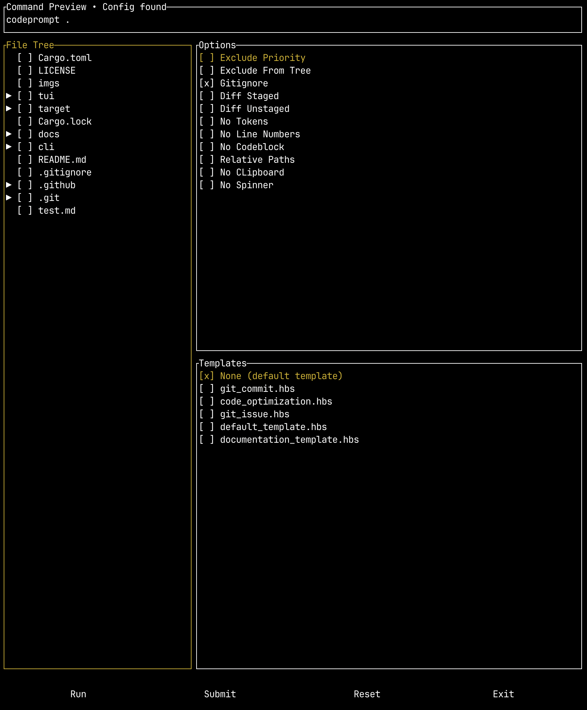

# Code Prompts

Command line (and TUI) tool for creating LLM prompts from your code using [Handlebars](https://handlebarsjs.com/) templates.

This was a project to brush up on Rust and is based on [code2prompt](https://github.com/mufeedvh/code2prompt) with some additional functionality that I found useful.

- [Installation](#installation)
  - [Release Binary](#release-binary)
  - [Building From Source](#building-from-source)
- [Usage](#usage)
  - [Arguments](#arguments)
- [Templates](#templates)
- [Usage Guides](./docs/README.md)
- [Terminal User Interface](#terminal-user-interface)

---

## Installation

To download and use the codeprompts command-line tool, you have two options: you can download the release binary or compile from source. For more detailed steps, including setting up tab completions, see the [setup](/docs/setup.md) guide.

### Release Binary

To download a release binary, go to the [releases](https://github.com/seankim658/codeprompts/releases) and download the binary for your OS.

**Note**: In order to use the TUI binary, you will have to add the CLI binary to your path and either:

- Rename the CLI release binary to `codeprompt`, or
- Update the config file for the command to run the CLI binary

### Building From Source

To build from source you will need to have [git](https://git-scm.com/downloads), [Rust](https://doc.rust-lang.org/book/ch01-01-installation.html), and Cargo (will be installed with Rust) installed.

First clone the repository:

```bash
git clone git@github.com:seankim658/codeprompts.git
```

And then compile a release binary:

```bash
cd codeprompts/
cargo build --release
```

## Usage

More detailed usage guides can be found [here](./docs/README.md).

### Arguments

More extensive documentation on the options can be found [here](./docs/options.md). The code prompts command line tool has the following arguments:

```txt

Create standardized LLM prompts from your code

Usage: codeprompt [OPTIONS] [PATH] [COMMAND]

Commands:
  completion  Generate shell completion scripts.
  help        Print this message or the help of the given subcommand(s)

Arguments:
  [PATH]  Path to project directory

Options:
      --include <INCLUDE>    Glob patterns to include
      --exclude <EXCLUDE>    Glob patterns to exclude
      --exclude-priority     Change pattern priority in case of conflict to prioritize the exclusion pattern
      --exclude-from-tree    Eclude files/folders from the source tree based on exclude patterns
      --gitignore            Don't respect .gitignore file
  -d, --diff-staged          Capture the git diff for staged changes only (equivalent to running `git diff --cached` or `git diff --staged`
  -u, --diff-unstaged        Capture the git diff for unstaged changes only (equivalent to running `git diff`)
      --no-tokens            Don't display approximate token count of the genrated prompt
  -c, --encoding <ENCODING>  Tokenizer to use for token count [default: cl100k]
  -o, --output <OUTPUT>      Redirect output to file
  -l, --no-line-numbers      Turn off line numbers in source code blocks
      --no-codeblock         Disable wrapping code inside markdown code blocks
      --relative-paths       Use relative paths instead of absolute paths, including parent directory
      --no-clipboard         Disable copying to clipboard
  -t, --template <TEMPLATE>  Optional path to Handlebars template
      --no-spinner           Whether to render the spinner
      --json                 Whether to print the output as JSON. Defaults to False
      --issue <ISSUE>        Fetch a specific Github issue for the repository
      --verbose              Run in verbose mode to investigate glob pattern matching
  -h, --help                 Print help (see more with '--help')
  -V, --version              Print version
```

## Templates

The templates use a simple templating language called [Handlebars](https://handlebarsjs.com/guide/).

The pre-defined templates can be downloaded from the project [releases](https://github.com/seankim658/codeprompts/releases). Download the `templates.zip`.

Currently, the included pre-defined templates are:

| Template Name                                                              | Description                                                                                                                                                                |
| -------------------------------------------------------------------------- | -------------------------------------------------------------------------------------------------------------------------------------------------------------------------- |
| [`default_template.hbs`](./src/templates/default_template.hbs)             | This is a simple default template that will structure your project path, source tree, and code blocks.                                                                     |
| [`documentation_template.hbs`](./src/templates/documentation_template.hbs) | The documentation template creates a prompt for documenting code. The documentation guidelines are consistent with the HIVE lab guidelines and documentation requirements. |
| [`git_commit.hbs`](./src/templates/git_commit.hbs)                         | Template for creating a concise and accurate git commit message. Can be used with both the `diff-staged` and `diff-unstaged` options.                                      |
| [`git_issues.hbs`](./src/templates/git_issue.hbs)                          | Template for implementing changes based on a Github issue.                                                                                                                 |
| [`code_optimization.hbs`](./src/templates/code_optimization.hbs)           | Template for optimizing code in time and space complexity.                                                                                                                 |

## Terminal User Interface



The project also includes an optional TUI wrapper where you can provide a [config file](./docs/tui_config_file.md) to override various flags and see how the command is structured before running it.
